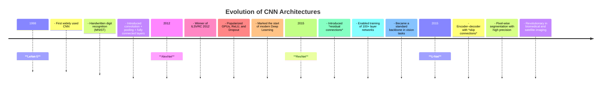

# Famous CNN Architectures from Scratch (PyTorch)

This repository contains **from-scratch implementations** of several iconic Convolutional Neural Network (CNN) architectures using **PyTorch**.  
Each model is built manually without relying on `torchvision.models`, providing full control over architecture design, training loops, and visualization of what the network learns.

---

## 📌 Implemented Architectures

- **LeNet-5 (1998)** – One of the earliest CNNs, designed for handwritten digit recognition (MNIST). Introduced convolution + pooling + fully connected layers, laying the foundation of deep learning for vision.  
- **AlexNet (2012)** – The breakthrough model that won ILSVRC 2012. Popularized deep CNNs, GPU training, ReLU activations, and dropout, marking the start of the modern deep learning era.  
- **U-Net (2015)** – A U-shaped encoder–decoder architecture for semantic segmentation. Introduced skip connections to preserve spatial information and became the standard in medical imaging and beyond.  
- **ResNet-50 (2015)** – Residual networks that solved the vanishing gradient problem, enabling training of ultra-deep architectures. ResNet-50 remains one of the most widely used backbones in computer vision.  

---

## 🔮 Planned Implementations

- **Inception (GoogLeNet, 2014)** – Multi-branch convolutional architecture with factorized filters and auxiliary classifiers, reducing computational cost while improving accuracy.  
- **VGGNet (2014)** – Characterized by its simplicity: stacks of 3×3 convolutions and max-pooling layers. Known for its depth (up to 19 layers) and strong performance on ImageNet, though computationally heavy.  
- **MobileNet (2017)** – Lightweight CNN designed for mobile and embedded devices. Uses depthwise separable convolutions to drastically reduce parameter count and computation while maintaining accuracy.  
- **DenseNet (2017)** – Densely connected convolutional network where each layer receives inputs from all previous layers. Promotes feature reuse, improves gradient flow, and achieves high efficiency with fewer parameters.  

---

## 🚀 Features

- Implementations built **line-by-line from scratch** in PyTorch.  
- Modular code: layers, residual blocks, and classifier heads defined separately.  
- Works with standard datasets like **MNIST**, **STL-10**, **Oxford-IIIT Pets**, and **CIFAR-10**.  
- **Training utilities**: progress bars, mixed precision support, top-k accuracy metrics.  
- **Evaluation utilities**: Grad-CAM, feature map visualization, confusion matrices, embeddings (t-SNE/UMAP).  

---

## 🖼 Visualization Examples

- **Predictions on the test set**  
  Display grids of correct vs. incorrect predictions with labels.  

- **Feature Maps & Filters**  
  Inspect learned kernels and intermediate activations across layers.  

- **Grad-CAM Heatmaps**  
  Visualize which regions of the image drive the network’s decisions.  

- **Embeddings**  
  Project high-dimensional feature representations into 2D with UMAP/t-SNE to explore class separability.  

These tools provide insights into **what CNNs learn internally**, from low-level filters to high-level semantic representations.

---

## 🕰 Historical Evolution of CNNs

## 📚 References

- LeCun, Y., Bottou, L., Bengio, Y., & Haffner, P. (1998). *Gradient-based learning applied to document recognition*. Proceedings of the IEEE, 86(11), 2278–2324.  
- Krizhevsky, A., Sutskever, I., & Hinton, G. E. (2012). *ImageNet classification with deep convolutional neural networks*. NeurIPS 25.  
- Ronneberger, O., Fischer, P., & Brox, T. (2015). *U-Net: Convolutional Networks for Biomedical Image Segmentation*. MICCAI.  
- He, K., Zhang, X., Ren, S., & Sun, J. (2015). *Deep residual learning for image recognition*. CVPR.  
- Coates, A., Ng, A. Y., & Lee, H. (2011). *An analysis of single-layer networks in unsupervised feature learning*. AISTATS.  
- PyTorch Documentation: [https://pytorch.org/docs/stable/index.html](https://pytorch.org/docs/stable/index.html)  
- Datasets: [MNIST](http://yann.lecun.com/exdb/mnist/), [STL-10](https://cs.stanford.edu/~acoates/stl10/), [Oxford-IIIT Pets](https://www.robots.ox.ac.uk/~vgg/data/pets/), [CIFAR-10](https://www.cs.toronto.edu/~kriz/cifar.html)  

---

## 📝 License

This project is licensed under the **MIT License** – you are free to use, modify, and distribute this code, provided that appropriate credit is given to the original author...
