# 🧠 Famous CNNs — From Scratch in PyTorch

This repository contains **from-scratch implementations** of the most influential Convolutional Neural Network (CNN) architectures, fully written in **PyTorch**. Every layer, block, and training primitive is handcrafted — no `torchvision.models` shortcuts — so you can audit, customize, and extend each network just like the original papers intended.

## 📑 Table of Contents

1. [Architectures at a Glance](#-architectures-at-a-glance)
2. [Features & Tooling](#-features--tooling)
3. [Repository Tour](#-repository-tour)
4. [Visualization Suite](#-visualization-suite)
5. [Historical Timeline](#-historical-timeline)
6. [References](#-references)
7. [License](#-license)

---

## 📚 Architectures at a Glance

| Year | Architecture | Highlights | Paper |
| --- | --- | --- | --- |
| 1998 | **LeNet-5** | First end-to-end CNN for handwritten digits; conv–pool–FC pipeline | [LeCun et al., 1998](http://yann.lecun.com/exdb/publis/pdf/lecun-01a.pdf) |
| 2012 | **AlexNet** | ReLU, dropout, data augmentation, multi-GPU training | [Krizhevsky et al., 2012](https://proceedings.neurips.cc/paper/2012/hash/c399862d3b9d6b76c8436e924a68c45b-Abstract.html) |
| 2014 | **VGG** | Deep stacks of 3×3 convolutions & max-pooling | [Simonyan & Zisserman, 2015](https://arxiv.org/abs/1409.1556) |
| 2014 | **Inception v1 (GoogLeNet)** | Multi-branch filters + auxiliary heads for better regularization | [Szegedy et al., 2015](https://arxiv.org/abs/1409.4842) |
| 2015 | **ResNet-50/101** | Residual skip connections unlock 100+ layer training | [He et al., 2016](https://arxiv.org/abs/1512.03385) |
| 2015 | **U-Net** | Encoder–decoder with skip connections for segmentation | [Ronneberger et al., 2015](https://arxiv.org/abs/1505.04597) |
| 2017 | **MobileNet v1 - v2** | Depthwise separable convolutions for edge devices | [Howard et al., 2017](https://arxiv.org/abs/1704.04861) |
| 2019 | **EfficientNet v1** | Compound scaling of depth/width/resolution | [Tan & Le, 2019](https://arxiv.org/abs/1905.11946) |

> **Planned**: **DenseNet** (2017) — densely connected feature reuse across layers for improved gradient flow and parameter efficiency [Huang et al., 2017](https://arxiv.org/abs/1608.06993).

---

## ⚙️ Features & Tooling

- **Faithful re-implementations**: each model mirrors the math, layer ordering, and hyper-parameters described in the original papers.
- **Modular building blocks**: convolutional stems, bottlenecks, attention modules, and classifier heads live in isolated files for easy reuse.
- **Training-ready utilities**: AMP, gradient clipping, cosine & step LR schedulers, label smoothing, mixed-precision checkpoints, and experiment configs.
- **Dataset loaders** tuned for **MNIST**, **STL-10**, **Food-101**, **CIFAR-10**, and **Oxford-IIIT Pets** with reproducible augmentations.
- **Evaluation extras**: Grad-CAM, confusion matrices, UMAP/t-SNE embeddings, parameter/FLOP counters, and latency benchmarks.
- **Quality gates**: lightweight unit tests under `tests/` ensure each architectural component behaves as expected.

---

## 🗂 Repository Tour

- `lenet/`, `alexnet/`, `vgg/`, `incpetion/`, `resnet/`, `u-net/`, `mobilenet/`, `efficient-net/`: Self-contained projects with their own configs, datasets, and training scripts. Each folder mirrors the canonical paper structure (layers → blocks → model → trainer) so you can study or fine-tune a single architecture in isolation.
- `pyproject.toml`, `poetry.lock`: Shared dependency management via Poetry for deterministic environments.
- `tests/` *(referenced in every submodule)*: Component tests for convolutional blocks, residual units, attention heads, and utility functions.
- Root-level `README.md`: Your quickstart hub (this document) that links out to every implementation.

> ℹ️ Each subdirectory is intentionally self-sufficient — think of them as mini-repos — so this overview keeps things concise while still explaining what you’ll find within.

---

## 🖼 Visualization Suite

- **Prediction grids**: Track correct vs. incorrect classifications to diagnose failure modes by class.
- **Feature maps & learned filters**: Peek inside early vs. late layers to see how representations evolve.
- **Grad-CAM heatmaps**: Attribute final decisions back to spatial regions for explainability.
- **Latent embeddings**: UMAP/t-SNE projections expose how separable different classes become across training.

Together, these plots double as sanity checks and storytelling artifacts for blog posts, talks, or lab notebooks.

---

## 🕰 Historical Timeline

```mermaid
%%{init: {"theme": "default", "themeVariables": { "fontSize": "16px"}, "logLevel": "debug", "scale": 1.5 }}%%
timeline
    title Evolution of CNN Architectures
    1998 : **LeNet-5**
        - First widely used CNN for digit recognition (MNIST)
        - Introduced convolution + pooling + fully connected stages

    2012 : **AlexNet**
        - ILSVRC 2012 winner with ReLU, dropout, and aggressive data aug
        - Kickstarted the modern deep learning wave

    2014 : **VGG**
        - Demonstrated that depth + uniform 3×3 kernels improve accuracy
        - Became a go-to feature extractor for transfer learning

    2014 : **GoogLeNet (Inception v1)**
        - Parallel 1×1, 3×3, 5×5 convs + pooling within one block
        - Auxiliary classifiers to stabilize gradients

    2015 : **ResNet**
        - Residual skip connections solved vanishing gradients
        - Enabled training 50/101/152-layer models

    2015 : **U-Net**
        - Encoder–decoder with skip connections for dense prediction
        - Revolutionized biomedical & satellite segmentation

    2017 : **MobileNet**
        - Depthwise separable convolutions for mobile/edge devices
        - Trade-off knobs (α, ρ) for latency vs. accuracy

    2019 : **EfficientNet**
        - Compound scaling across depth/width/resolution
        - Pareto-front efficiency on ImageNet and transfer tasks

    2024 : **DenseNet (planned)**
        - Dense connectivity to encourage feature reuse
        - Completes the chronological arc of classic CNNs
```

---

## 📚 References

- LeCun, Bottou, Bengio & Haffner. *Gradient-Based Learning Applied to Document Recognition.* Proc. IEEE 1998.
- Krizhevsky, Sutskever & Hinton. *ImageNet Classification with Deep Convolutional Neural Networks.* NeurIPS 2012.
- Simonyan & Zisserman. *Very Deep Convolutional Networks for Large-Scale Image Recognition.* ICLR 2015.
- Szegedy et al. *Going Deeper with Convolutions.* CVPR 2015.
- He, Zhang, Ren & Sun. *Deep Residual Learning for Image Recognition.* CVPR 2016.
- Ronneberger, Fischer & Brox. *U-Net: Convolutional Networks for Biomedical Image Segmentation.* MICCAI 2015.
- Howard et al. *MobileNets: Efficient Convolutional Neural Networks for Mobile Vision Applications.* arXiv 2017.
- Huang, Liu, Van Der Maaten & Weinberger. *Densely Connected Convolutional Networks.* CVPR 2017.
- Tan & Le. *EfficientNet: Rethinking Model Scaling for Convolutional Neural Networks.* ICML 2019.

---

## 📝 License

This project is licensed under the **MIT License** — you are free to use, modify, and distribute this code, provided that appropriate credit is given to the original author.
