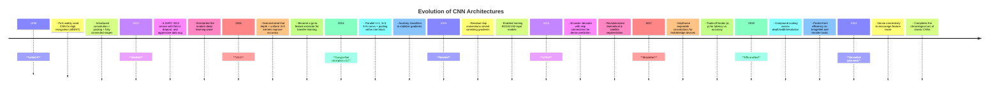

# PyTorch CNN Architectures

[](https://www.python.org/)
[](LICENSE)


[](https://github.com/pablo-reyes8/famous-cnns-from-scratch/actions/workflows/ci.yml)
[](https://github.com/pablo-reyes8/famous-cnns-from-scratch/actions/workflows/codeql.yml)


A collection of **from-scratch PyTorch implementations** of influential CNN architectures. Each model is implemented without `torchvision.models` abstractions to keep the code **transparent**, **auditable**, and easy to modify for research and education.

The repository is designed as a **code-first literature review** of CNN architecture evolution (LeNet → AlexNet/VGG/Inception → ResNet → U-Net/MobileNet/EfficientNet). Each architecture is organized as a self-contained module with training scripts, lightweight tests, and short notes that map implementation details to the original paper.

## 📑 Table of Contents

1. [Unified Library API](#-unified-library-api)
2. [Architectures at a Glance](#-architectures-at-a-glance)
3. [Command-line and Docker](#-command-line-and-docker)
4. [Research Focus](#research-focus)
5. [Features & Tooling](#features-tooling)
6. [Repository Tour](#-repository-tour)
7. [Visualization Suite](#-visualization-suite)
8. [Historical Timeline](#-historical-timeline)
9. [Contributing and Security](#-contributing-and-security)
10. [References](#-references)
11. [License](#-license)

---

## 🚀 Unified Library API

The original architecture folders remain independent and readable, while the root-level `famous_cnns` package provides one stable interface over all of them. Install the project in editable mode during development:

```bash
pip install -e .
```

### Build models like `torchvision.models`

```python
from famous_cnns import create_model, list_models

print(list_models())

# The first convolution is automatically changed from RGB to five channels.
model = create_model(
    "resnet50",
    num_classes=12,
    in_channels=5,
)

# Architecture-specific options are still available.
mobile = create_model(
    "mobilenet_v2",
    num_classes=12,
    in_channels=3,
    width_mult=0.75,
)

efficient = create_model("efficientnet_b3", num_classes=12)
segmenter = create_model("unet", num_classes=4, in_channels=1, base=32)
```

Canonical names are `lenet5`, `alexnet`, `vgg16`, `inception_v1`, `resnet50`, `resnet101`, `unet`, `mobilenet_v1`, `mobilenet_v2`, and `efficientnet`. Useful aliases such as `lenet`, `googlenet`, `u-net`, and `efficientnet_b0` through `efficientnet_b7` are accepted.

### One orchestrator for training and inference

```python
from famous_cnns import CNNOrchestrator

cnn = CNNOrchestrator(
    "resnet50",
    num_classes=10,
    in_channels=3,
    optimizer="adamw",       # adam, adamw, sgd, or rmsprop
    lr=3e-4,
    optimizer_kwargs={"weight_decay": 1e-4},
    device="cuda",           # omit for automatic CUDA/CPU selection
    auto_resize=True,         # optional resize to the recommended input size
)

history = cnn.fit(
    train_loader,
    epochs=20,
    val_loader=validation_loader,
    scheduler=scheduler,      # optional PyTorch scheduler
)

metrics = cnn.evaluate(test_loader)
probabilities = cnn.predict(images)
print(cnn.summary())
cnn.save("checkpoints/resnet50.pt")
```

The orchestrator automatically uses cross-entropy for classification, binary cross-entropy for one-class U-Net segmentation, auxiliary Inception losses during training, and pixel accuracy for segmentation. A custom PyTorch loss can be supplied with `criterion=...`.

### Optimizers and visualizations

An optimizer can also be created without the orchestrator:

```python
from famous_cnns import create_optimizer

optimizer = create_optimizer(
    model.parameters(),
    "sgd",
    lr=0.01,
    momentum=0.9,
)
```

Training curves, prediction grids, and internal feature maps share the same model-agnostic API and return standard Matplotlib figures:

```python
fig_history = cnn.plot_history()
fig_predictions = cnn.plot_predictions(
    images,
    targets,
    class_names=class_names,
)
fig_features = cnn.plot_feature_maps(images[:1], layer="layer3")

fig_history.savefig("training_history.png", dpi=150, bbox_inches="tight")
```

Input channels are adapted automatically, but spatial size still follows each architecture. `auto_resize=True` handles the recommended square size in the orchestrator; it is especially useful for LeNet-5 (32×32) and VGG-16 (224×224).

---

## 💻 Command-line and Docker

The same high-level API is available from the terminal:

```bash
famous-cnns list
famous-cnns info resnet50

famous-cnns train \
  --model resnet50 \
  --num-classes 10 \
  --data-dir dataset \
  --optimizer adamw \
  --epochs 20 \
  --output outputs/resnet50.pt

famous-cnns infer \
  --checkpoint outputs/resnet50.pt \
  --input samples/ \
  --output outputs/predictions.json
```

Every architecture folder also contains `scripts/train.py` and `scripts/infer.py`. See the complete [CLI and dataset guide](docs/CLI.md).

Run the packaged CLI without configuring a local Python environment:

```bash
docker build -t famous-cnns:local .
docker run --rm famous-cnns:local list
docker compose --profile test run --rm smoke-test
```

The container runs as a non-root user. Mount datasets at `/workspace/data` and write checkpoints to `/workspace/outputs`.

---

## 📚 Architectures at a Glance

| Year | Architecture | Highlights | Paper |
| --- | --- | --- | --- |
| 1998 | **LeNet-5** | First end-to-end CNN for handwritten digits; conv–pool–FC pipeline | [LeCun et al., 1998](http://yann.lecun.com/exdb/publis/pdf/lecun-01a.pdf) |
| 2012 | **AlexNet** | ReLU, dropout, data augmentation, multi-GPU training | [Krizhevsky et al., 2012](https://proceedings.neurips.cc/paper/2012/hash/c399862d3b9d6b76c8436e924a68c45b-Abstract.html) |
| 2014 | **VGG** | Deep stacks of 3×3 convolutions & max-pooling | [Simonyan & Zisserman, 2015](https://arxiv.org/abs/1409.1556) |
| 2014 | **Inception v1 (GoogLeNet)** | Multi-branch filters + auxiliary heads for better regularization | [Szegedy et al., 2015](https://arxiv.org/abs/1409.4842) |
| 2015 | **ResNet-50/101** | Residual skip connections unlock 100+ layer training | [He et al., 2016](https://arxiv.org/abs/1512.03385) |
| 2015 | **U-Net** | Encoder–decoder with skip connections for segmentation | [Ronneberger et al., 2015](https://arxiv.org/abs/1505.04597) |
| 2017 | **MobileNet v1 - v2** | Depthwise separable convolutions for edge devices | [Howard et al., 2017](https://arxiv.org/abs/1704.04861) |
| 2019 | **EfficientNet v1** | Compound scaling of depth/width/resolution | [Tan & Le, 2019](https://arxiv.org/abs/1905.11946) |

> **Planned**: **DenseNet** (2017) — densely connected feature reuse across layers for improved gradient flow and parameter efficiency [Huang et al., 2017](https://arxiv.org/abs/1608.06993).

---


## 🎓 Research Focus 

The goal of this repository is to play a similar role to a *survey article*, but in executable form:

- **Bridge papers and code.**  
  For each architecture (LeNet, AlexNet, VGG, Inception, ResNet, U-Net, MobileNet, EfficientNet), the implementation mirrors the math, layer ordering, and design choices described in the original work, while staying readable and hackable in modern PyTorch. 

- **Organize the CNN literature into “code modules”.**  
  Each subfolder (`lenet/`, `alexnet/`, `vgg/`, `incpetion/`, `resnet/`, `u-net/`, `mobilenet/`, `efficient-net/`) is a self-contained lab:
  - model definition (layers → blocks → full network),
  - training loop and configs for standard datasets (e.g. MNIST, CIFAR, STL, Food-101),
  - evaluation utilities (metrics, basic plots, or visualizations specific to that architecture),
  - local tests to ensure shapes, residual paths, and forward passes behave as expected. 

- **Highlight design patterns across generations.**  
  The repo is structured so you can *compare and contrast* how CNNs evolved:
  - early conv–pool–FC pipelines (LeNet) vs. deep stacks of small kernels (VGG),
  - multi-branch modules (Inception) vs. residual connections (ResNet),
  - encoder–decoder with skips for dense prediction (U-Net),
  - efficiency-oriented designs (depthwise separable convs in MobileNet; compound scaling in EfficientNet). 

- **Act as a base for systematic experiments.**  
  Even before large cross-model benchmarks are added, the repository is already structured to support:
  - accuracy–vs–compute comparisons (params, FLOPs, latency),
  - visualization-driven analysis (feature maps, Grad-CAM, embeddings),
  - small, reproducible experiments per architecture (e.g. “train ResNet vs. VGG under the same CIFAR-10 setup”). 

In other words, this project aims to be a **living survey of classic CNN architectures**: instead of only reading about LeNet, AlexNet, VGG, Inception, ResNet, U-Net, MobileNet, and EfficientNet, you can *run*, inspect, and extend them from a single, coherent codebase.

---

## ⚙️ Features & Tooling 

- **Faithful re-implementations**: each model mirrors the math, layer ordering, and hyper-parameters described in the original papers.
- **Modular building blocks**: convolutional stems, bottlenecks, attention modules, and classifier heads live in isolated files for easy reuse.
- **Training-ready utilities**: AMP, gradient clipping, cosine & step LR schedulers, label smoothing, mixed-precision checkpoints, and experiment configs.
- **Dataset loaders** tuned for **MNIST**, **STL-10**, **Food-101**, **CIFAR-10**, and **Oxford-IIIT Pets** with reproducible augmentations.
- **Evaluation extras**: Grad-CAM, confusion matrices, UMAP/t-SNE embeddings, parameter/FLOP counters, and latency benchmarks.
- **Quality gates**: lightweight unit tests under `tests/` ensure each architectural component behaves as expected.

---

## 🗂 Repository Tour

- `lenet/`, `alexnet/`, `vgg/`, `incpetion/`, `resnet/`, `u-net/`, `mobilenet/`, `efficient-net/`: Self-contained projects with their own configs, datasets, and training scripts. Each folder mirrors the canonical paper structure (layers → blocks → model → trainer) so you can study or fine-tune a single architecture in isolation.
- `pyproject.toml`, `poetry.lock`: Shared dependency management via Poetry for deterministic environments.
- `tests/` *(referenced in every submodule)*: Component tests for convolutional blocks, residual units, attention heads, and utility functions.
- Root-level `README.md`: Your quickstart hub (this document) that links out to every implementation.

> ℹ️ Each subdirectory is intentionally self-sufficient — think of them as mini-repos — so this overview keeps things concise while still explaining what you’ll find within.

---

## 🖼 Visualization Suite

- **Prediction grids**: Track correct vs. incorrect classifications to diagnose failure modes by class.
- **Feature maps & learned filters**: Peek inside early vs. late layers to see how representations evolve.
- **Grad-CAM heatmaps**: Attribute final decisions back to spatial regions for explainability.
- **Latent embeddings**: UMAP/t-SNE projections expose how separable different classes become across training.

Together, these plots double as sanity checks and storytelling artifacts for blog posts, talks, or lab notebooks.

---

## 🕰 Historical Timeline


```mermaid
%%{init: {"theme": "default", "themeVariables": { "fontSize": "16px"}, "logLevel": "debug", "scale": 1.5 }}%%
timeline
    title Evolution of CNN Architectures
    1998 : **LeNet-5**
        - First widely used CNN for digit recognition (MNIST)
        - Introduced convolution + pooling + fully connected stages

    2012 : **AlexNet**
        - ILSVRC 2012 winner with ReLU, dropout, and aggressive data aug
        - Kickstarted the modern deep learning wave

    2014 : **VGG**
        - Demonstrated that depth + uniform 3×3 kernels improve accuracy
        - Became a go-to feature extractor for transfer learning

    2014 : **GoogLeNet (Inception v1)**
        - Parallel 1×1, 3×3, 5×5 convs + pooling within one block
        - Auxiliary classifiers to stabilize gradients

    2015 : **ResNet**
        - Residual skip connections solved vanishing gradients
        - Enabled training 50/101/152-layer models

    2015 : **U-Net**
        - Encoder–decoder with skip connections for dense prediction
        - Revolutionized biomedical & satellite segmentation

    2017 : **MobileNet**
        - Depthwise separable convolutions for mobile/edge devices
        - Trade-off knobs (α, ρ) for latency vs. accuracy

    2019 : **EfficientNet**
        - Compound scaling across depth/width/resolution
        - Pareto-front efficiency on ImageNet and transfer tasks

    2024 : **DenseNet (planned)**
        - Dense connectivity to encourage feature reuse
        - Completes the chronological arc of classic CNNs
```

---

## 🤝 Contributing and Security

Contributions are welcome. Read [CONTRIBUTING.md](CONTRIBUTING.md) for the development workflow and [CODE_OF_CONDUCT.md](CODE_OF_CONDUCT.md) for community expectations. Report vulnerabilities privately according to [SECURITY.md](SECURITY.md); do not disclose them in public issues.

The repository includes CI tests, package validation, CodeQL scanning, dependency review, Dependabot updates, Docker build checks, issue templates, code ownership, a changelog, and citation metadata. The high-level design is summarized in [docs/ARCHITECTURE.md](docs/ARCHITECTURE.md). After merging, apply the protections in [docs/REPOSITORY_SETTINGS.md](docs/REPOSITORY_SETTINGS.md), since branch rules and security toggles cannot be committed as files.

---

## 📚 References

- LeCun, Bottou, Bengio & Haffner. *Gradient-Based Learning Applied to Document Recognition.* Proc. IEEE 1998.
- Krizhevsky, Sutskever & Hinton. *ImageNet Classification with Deep Convolutional Neural Networks.* NeurIPS 2012.
- Simonyan & Zisserman. *Very Deep Convolutional Networks for Large-Scale Image Recognition.* ICLR 2015.
- Szegedy et al. *Going Deeper with Convolutions.* CVPR 2015.
- He, Zhang, Ren & Sun. *Deep Residual Learning for Image Recognition.* CVPR 2016.
- Ronneberger, Fischer & Brox. *U-Net: Convolutional Networks for Biomedical Image Segmentation.* MICCAI 2015.
- Howard et al. *MobileNets: Efficient Convolutional Neural Networks for Mobile Vision Applications.* arXiv 2017.
- Tan & Le. *EfficientNet: Rethinking Model Scaling for Convolutional Neural Networks.* ICML 2019.

---

## 📝 License

This project is licensed under the **MIT License** — you are free to use, modify, and distribute this code, provided that appropriate credit is given to the original author.
