# 🧠 Famous CNNs — From Scratch in PyTorch

This repository contains **from-scratch implementations** of the most influential Convolutional Neural Network (CNN) architectures, fully written in **PyTorch**.  
Each model is implemented manually — without `torchvision.models` — to offer complete control over architecture design, parameterization, and training logic.

---

## 📚 Implemented Architectures

- **LeNet-5 (1998)** — The pioneer of CNNs, introduced convolution–pooling–fully connected structures for digit recognition (MNIST).  
- **AlexNet (2012)** — Revolutionized computer vision by introducing ReLU activations, dropout, and GPU-based training, achieving a breakthrough at ILSVRC 2012.  
- **VGGNet (2014)** — Deep yet simple, built on stacks of 3×3 convolutions and max-pooling, setting the benchmark for clean, uniform CNN design.  
- **Inception v1 (GoogLeNet, 2014)** — Multi-branch convolutions (1×1, 3×3, 5×5, pooling) run in parallel for efficient multi-scale feature extraction, with auxiliary classifiers to stabilize training.  
- **ResNet-50/101 (2015)** — Introduced residual connections that solved the vanishing gradient problem, enabling ultra-deep models. Still a dominant backbone in vision tasks.  
- **U-Net (2015)** — Encoder–decoder design for segmentation, with skip connections to preserve spatial context; cornerstone of biomedical and dense prediction tasks.  
- **EfficientNet v1 (2019)** — Compound scaling of depth, width, and resolution, achieving state-of-the-art accuracy–efficiency trade-offs from B0–B7 variants.  

---

## 🔮 Planned Implementations

- **MobileNet (2017)** — Lightweight model optimized for mobile inference, using depthwise separable convolutions for efficient computation.  
- **DenseNet (2017)** — Densely connected blocks where each layer receives all previous feature maps, improving gradient flow and parameter efficiency.  

---

## ⚙️ Features

- Fully **modular** codebase (layers, blocks, classifiers, and training loops separated).  
- **Line-by-line implementations** faithful to original papers.  
- Supports datasets like **MNIST**, **STL-10**, **Food-101**, **CIFAR-10**, and **Oxford-IIIT Pets**.  
- **Training utilities:** label smoothing, AMP, gradient clipping, dynamic LR scheduling.  
- **Evaluation tools:** Grad-CAM visualizations, confusion matrices, feature embeddings (t-SNE / UMAP).  
- Includes **unit tests** under `/tests/` for all architectural components.  

---

## 🖼 Visualization Examples

- **Predictions on the test set**  
  Display grids of correct vs. incorrect predictions with labels.  

- **Feature Maps & Filters**  
  Inspect learned kernels and intermediate activations across layers.  

- **Grad-CAM Heatmaps**  
  Visualize which regions of the image drive the network’s decisions.  

- **Embeddings**  
  Project high-dimensional feature representations into 2D with UMAP/t-SNE to explore class separability.  

These tools provide insights into **what CNNs learn internally**, from low-level filters to high-level semantic representations.

---

## 🕰 Historical Evolution of CNNs

```mermaid
%%{init: {"theme": "default", "themeVariables": { "fontSize": "18px"}, "logLevel": "debug", "scale": 2.0 }}%%
timeline
    title Evolution of CNN Architectures
    1998 : **LeNet-5**  
        - First widely used CNN  
        - Handwritten digit recognition (MNIST)  
        - Introduced convolution + pooling + fully connected layers  
    
    2012 : **AlexNet**  
        - Winner of ILSVRC 2012  
        - Popularized GPUs, ReLU, and Dropout  
        - Marked the start of modern Deep Learning

    2014 : **VGG**  
        - Very deep CNN (16–19 layers) with simple 3×3 conv filters  
        - Demonstrated depth as a key factor for accuracy  
        - Became a widely used feature extractor in transfer learning

    2014 : **GoogLeNet (Inception v1)**  
        - Multi-branch blocks: 1×1, 3×3, 5×5 convs + pooling in parallel  
        - 1×1 convolutions for dimensionality reduction (bottlenecks)  
        - Auxiliary classifiers to improve gradient flow and regularization  
        - Winner of ILSVRC 2014 with far fewer parameters than VGG

    2015 : **ResNet**  
        - Introduced *residual connections*  
        - Enabled training of 100+ layer networks  
        - Became a standard backbone in vision tasks  
    
    2015 : **U-Net**  
        - Encoder–decoder with *skip connections*  
        - Pixel-wise segmentation with high precision  
        - Revolutionary in biomedical and satellite imaging  

    2019 : **EfficientNet**  
        - Introduced *compound scaling* of depth, width, and resolution  
        - Achieved state-of-the-art accuracy with far fewer parameters  
        - Optimized model scaling using a principled approach (α, β, γ)  
        - Set new efficiency benchmarks across multiple vision tasks  
```

## 📚 References

- LeCun et al. *Gradient-Based Learning Applied to Document Recognition.* Proc. IEEE 1998.  
- Krizhevsky et al. *ImageNet Classification with Deep Convolutional Neural Networks.* NeurIPS 2012.  
- Simonyan & Zisserman. *Very Deep Convolutional Networks for Large-Scale Image Recognition.* ICLR 2015.  
- Szegedy et al. *Going Deeper with Convolutions.* CVPR 2015.  
- He et al. *Deep Residual Learning for Image Recognition.* CVPR 2016.  
- Tan & Le. *EfficientNet: Rethinking Model Scaling for Convolutional Neural Networks.* ICML 2019. 

---

## 📝 License

This project is licensed under the **MIT License**: you are free to use, modify, and distribute this code, provided that appropriate credit is given to the original author...
